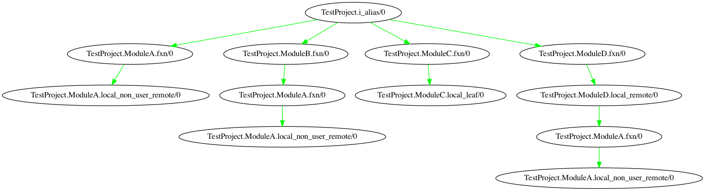

# CodeVis

Compile-time tool to visualize elixir applications flow.



## Setup

```bash
# External dep on `dot` cmd line util
> brew install graphviz
> mix deps.get && mix compile
# this alias simplifies a big step
# Go to an example project, use `CodeVis` as a dep, and run the visualize task
> mix try

TestProject.i_alias/0 ->
--TestProject.ModuleA.fxn/0 -> leaf
--TestProject.ModuleB.fxn/0 ->
----TestProject.ModuleA.fxn/0 -> leaf

--TestProject.ModuleC.fxn/0 ->
----TestProject.ModuleC.local_leaf/0 -> leaf

--TestProject.ModuleD.fxn/0 ->
----TestProject.ModuleD.local_remote/0 ->
------TestProject.ModuleA.fxn/0 -> leaf

```

## Next steps
Presenting this data leads to actionable change.
Is that in the form of removed redundancy?
Is that in the form of refactor to simplify?
Is it just to visualize the system?
Visual learning?

### Feedback from 1st real test case
* ✅ very wide without listing local functions
* (Bug 🐛) Prevent endless loops on circular deps
  * Ex - find one or create it. Not in compilation step, but in graph step

### Brainstorm - Potential views
What would I hope to see? In the fxn tree, more detailed, but you can see redundant calls to local fxns, and understand at a function level what your top level fxn is doing. Visualizing a single path. I think for this to be really useful, we need to include local functions that are branches.

Via module tree, that's a higher level view of how your modules are interacting. This is more interesting to me. Would help understand how your modules are interacting - leading to module level organization & visualizing the system more broadly. Also this graph will be smaller and ideally more direct. Also more complex UI since it's a module node with sub info. You lose out on knowing which functions call to which external modules, would need the more specific view for that. Each edge represents a dependancy, but unclear how many fxns on each side.

1. Fxn Tree
  Trace each call, through local functions & remote to see the code path visually
  1 Node per Fxn call
  Call this `code path` duh

2. Module Tree
  From the same data, we can aggregate under the module
  Given a starting fxn, find all of the locals and aggregate them under that module
  Then do the same for each remote call
  This means 1 node per Module (with data on each fxn call within)

Conclusion - `Module Tree` is a cool idea. There are a few things I would need between here and there, New UI idea to help represent a node with a list of additional details, also a reducer to build that type of map. For now, I'm going to complete the `Function Tree` fully. Display local branches, colors per module, line numbers on edges. Tests are great, but I don't think it's solidified yet to be there for most parts.

### Actions

* ✅ Capture local function calls as well
* ✅ Make it easy to run on other repositories
* ✅ Display local branches
* ✅ Add image to Readme
* ✅ (Idea) Color nodes based on module name, so that we can see redundancy
* ✅ Filter non-user code
  * ✅ Don't want to display `Enum` calls, etc. `CodeVis.ProjectAnalysis`
  * ✅ Test gathering user modules
  * Test filtering out of non-user modules
* Add tests
  * ✅ Easier manual test of full `mix visualize`
  * Test compilation tracer
  * Test Graphing independently
  * Test `:ets` to `Map` fxn
  * This turned out to be really hard! How do we test a mix task that recompiles the project?
    * [Boundary](https://github.com/sasa1977/boundary/blob/master/test/support/test_project.ex) does it by generating a dynamic project within the test setup!!
* (Quality) Struct for each node with available info
* (Decision) How to display circular deps? new node or re-use?
  * Currently, adds a new node, not the end of the world
* (minor) Edges could be labelled with the line number in the caller's module
  * Needs to collect more data - struct step

## Resources

* [Dashbit tracer example](https://gist.github.com/wojtekmach/4e04cbda82ba88af3f84c44ec746b7ca#file-import2alias-ex-L20)
* [AppSignal tracer](https://blog.appsignal.com/2020/03/10/building-compile-time-tools-with-elixir-compiler-tracing-features.html)

## Installation

Try it out on your project!

```elixir
def deps do
  [
    {:code_vis, git: "https://github.com/shamshirz/code_vis.git", tag: "0.1"}
  ]
end
```

```bash
> mix deps.get
> mix visualize YourModule.and_function/arity
```
