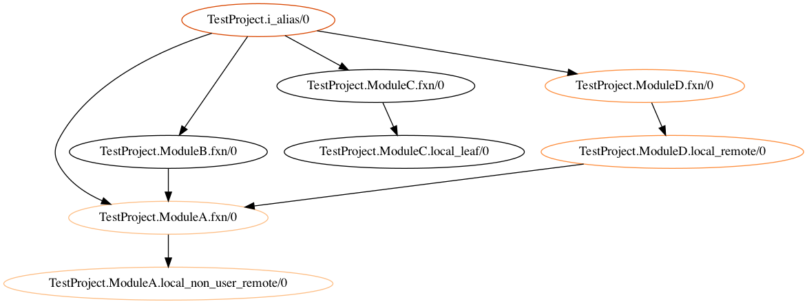

# CodeVis

Compile-time tool to visualize elixir applications flow.



## Setup

```bash
# External dep on `dot` cmd line util
> brew install graphviz
> mix deps.get && mix compile
# Static single graph
> mix try

# Dynamic graphing
# try localhost:1337?mfa=TestProject.i_alias/0
> cd test_project && mix code_vis.server
```

## Objectives
1. Get this in the hands of users
    * Easier to interact with than a mix CLI input
    * More accessible than needing to know `mfa()` by heart
2. Make value really obvious
    * Data is intuitive
### Key Results
* Increased use base by over 100%
* 50% of users can tell you what `CodeVis` does
## Actions
* ✅ Allow server to run outside of users application!
* Guide on how to add it to a project now!
* Replace cmd line dependency with js bundle in browser
  * Display graph in browser is easier than asking users to download a cmd line util
* Remove circular dep bug (don't add duplicate nodes)
 * Thought I fixed it, but I didn't - create test case
* (Maybe) search for function in index
* (Maybe) ngrok deployment for specific users of a project
* Tests
  * Filtering out of non-user modules
  * Intermediate -> Graph
  * `:ets` -> Intermediate
  * Compilation tracer
    * This turned out to be really hard! How do we test a mix task that recompiles the project?
      * [Boundary](https://github.com/sasa1977/boundary/blob/master/test/support/test_project.ex) does it by generating a dynamic project within the test setup!!
* (Quality) Struct for each node with available info
* (minor) Edges could be labelled with the line number in the caller's module
  * Needs to collect more data - struct step


## Resources

* [Dashbit tracer example](https://gist.github.com/wojtekmach/4e04cbda82ba88af3f84c44ec746b7ca#file-import2alias-ex-L20)
* [AppSignal tracer](https://blog.appsignal.com/2020/03/10/building-compile-time-tools-with-elixir-compiler-tracing-features.html)

## Installation

Try it out on your project!

```elixir
def deps do
  [
    {:code_vis, git: "https://github.com/shamshirz/code_vis.git", tag: "0.1"}
  ]
end
```

```bash
> mix deps.get
> mix visualize YourModule.and_function/arity
```
