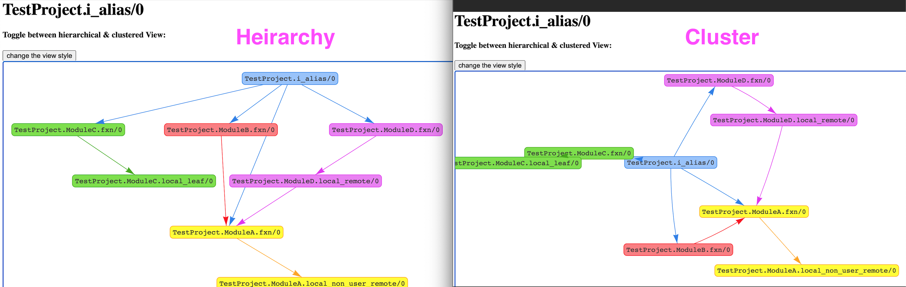

# CodeVis

Compile-time tool to visualize elixir applications flow.



## Installation

Try it out on your project!

```elixir
def deps do
  [
    {:code_vis, git: "https://github.com/shamshirz/code_vis.git"}
  ]
end
```

```bash
> mix deps.get
> mix code_vis.server
# Open localhost:1337
```

## Development Setup

```bash
> mix deps.get && mix compile
> cd test_project && mix deps.get && mix code_vis.server
```

## Roadmap
https://github.com/shamshirz/code_vis/projects/1

## Resources

* [Dashbit tracer example](https://gist.github.com/wojtekmach/4e04cbda82ba88af3f84c44ec746b7ca#file-import2alias-ex-L20)
* [AppSignal tracer](https://blog.appsignal.com/2020/03/10/building-compile-time-tools-with-elixir-compiler-tracing-features.html)
* [Basic JS autocomplete](https://github.com/leaverou/awesomplete)
